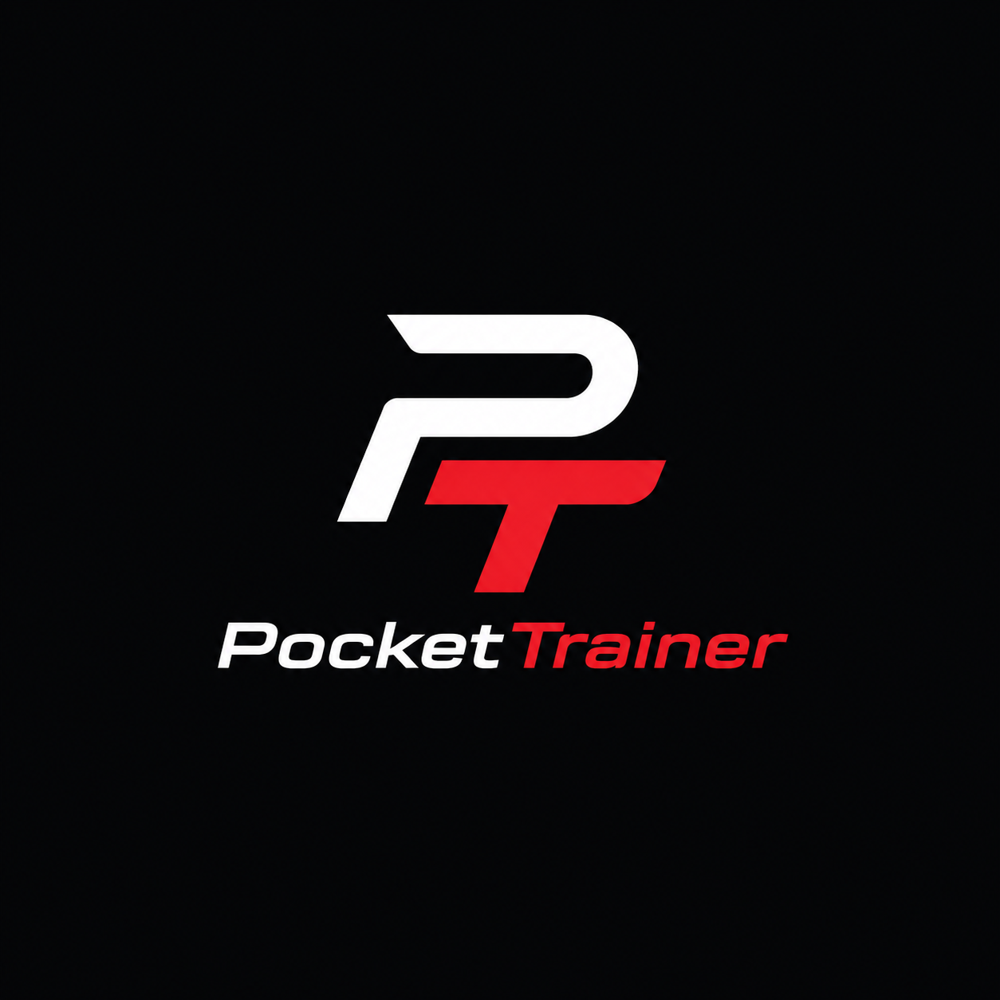
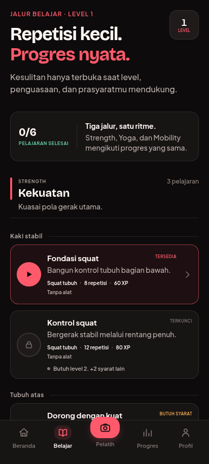
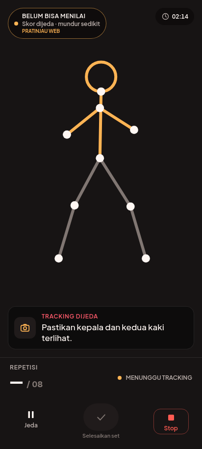
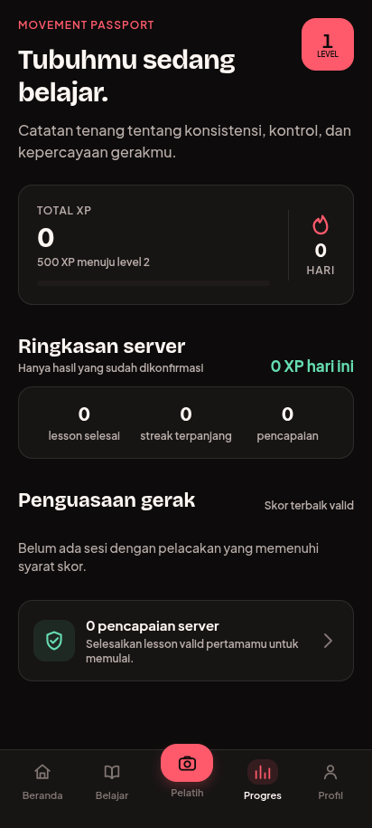
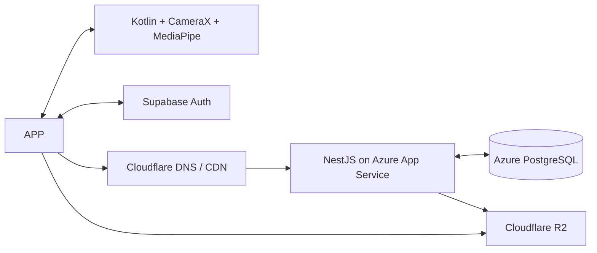

# PocketTrainer

<p align="center">
  
</p>

[](https://github.com/Xavrir/PocketTrainer/actions/workflows/ci.yml)
[](https://github.com/Xavrir/PocketTrainer/releases)
[](LICENSE)

**PocketTrainer turns learning good movement into a visible course path.** It combines Duolingo-style progression with private, on-device posture coaching for gym exercises, yoga, and mobility.

> Android-first hackathon MVP · Bahasa Indonesia first · Raw workout video never leaves the device

## Why it exists

Beginners often know *which* exercise to do but cannot tell whether they are doing it safely. Video subscriptions show ideal form; they do not see the person in front of the screen. PocketTrainer closes that loop with an assessment, a personalized learning path, real-time form feedback, and mastery-gated progression.

```text
Assessment → personalized path → coached lesson → form score → mastery + XP → safe unlock
```

## MVP experience

- Android-native posture scoring for body squat; unsupported movements remain clearly labeled guided practice without form scores.
- Strength, yoga, and mobility courses built from versioned lessons and prerequisites.
- XP, streak protection, achievements, and a Movement Passport.
- Authenticated workout submission with idempotent, server-authoritative XP and progression.
- Progression that requires both account level and demonstrated movement mastery.
- Explicit confidence and pain gates: uncertain tracking never becomes a low score or an unlock.
- Google-first Supabase identity with an email magic-link fallback, persisted sessions, foreground token refresh, and authenticated NestJS requests.

## Product preview

| Learn path | Native coaching | Progress passport |
|---|---|---|
|  |  |  |

The live state above demonstrates the no-score confidence gate. The native release was separately validated on a Samsung SM-A556E without Metro; its camera frame is intentionally not committed because workout imagery stays on-device.

## What makes it different

The live movement engine stays native. Camera frames, pose landmarks, movement state, feedback, and the skeleton overlay run on-device. React Native receives compact events only; the server receives derived workout summaries only.

## Architecture



| Layer | Choice | Responsibility |
|---|---|---|
| Mobile | React Native + TypeScript | Product UI, navigation, authenticated API orchestration |
| Movement | Kotlin, CameraX, MediaPipe | Private live inference, feedback, overlay |
| API | NestJS modular monolith | Auth boundary, catalog, plans, sync, progression |
| Product data | Azure PostgreSQL | RLS-protected user and curriculum data |
| Identity | Supabase Auth | Sign-in and short-lived session tokens only |
| Content edge | Cloudflare R2/CDN | Signed rule manifests and instruction media |

Read the full [architecture](documentation/ARCHITECTURE.md), [safety model](documentation/SAFETY_AND_PRIVACY.md), and [technical design source](documentation/TECHNICAL_DESIGN_SOURCE.md).

## Repository map

```text
apps/mobile/             React Native Android application
apps/api/                NestJS API
packages/contracts/      Shared wire and native-event contracts
packages/domain/         Progression, mastery, XP, and safety rules
packages/exercise-rules/ Versioned movement definitions
packages/validation/     Runtime schema validation
database/                PostgreSQL migrations and seed data
infrastructure/          Azure/Cloudflare deployment notes
documentation/           Architecture, demo, checkpoints, safety
```

## Local development

### Requirements

- Node.js 24+
- pnpm 11+
- Java 21 and Android Studio/SDK for the mobile build
- PostgreSQL 16+ for persistence-backed API development

```bash
pnpm install
pnpm check
pnpm api:dev
pnpm mobile:start
pnpm mobile:android
```

Copy `apps/api/.env.example` to `apps/api/.env` for local API configuration and `apps/mobile/.env.example` to `apps/mobile/.env` for the public Supabase URL, publishable key, and API origin. Local Android development explicitly uses `10.0.2.2`; release runtime rejects HTTP, localhost/private-network addresses, and temporary TryCloudflare API URLs. Release builds also fail closed when auth is missing; only debug/test builds may enable the explicit bypass. Never commit credentials, Supabase service keys, Azure connection strings, or signing keys. See [Supabase Auth setup](documentation/SUPABASE_AUTH.md).

## Standalone API deployment

The release-safe origin is NestJS on Azure App Service with Azure PostgreSQL at `https://pockettrainer-api-ae494c.azurewebsites.net`. The Azure-managed HTTPS FQDN remains available without Metro, ADB, or a developer machine. Cloudflare is an optional custom DNS/TLS/WAF layer; Quick Tunnels and laptop-hosted named tunnels are not release architecture.

The API image is pulled from the dedicated Azure Container Registry by managed identity. PostgreSQL uses a separate non-owner runtime role with forced RLS, and its firewall is restricted to the Web App outbound addresses plus the current migration-operator address. Follow the [standalone deployment runbook](documentation/DEPLOYMENT_RUNBOOK.md) and provider notes under `infrastructure/` for acceptance and rollback.

## Hackathon demo path

1. Complete the five-step onboarding and movement consent.
2. Take the short movement assessment.
3. Receive a personalized starting path.
4. Open a squat lesson and pass camera calibration.
5. Complete a set with one clear correction at a time.
6. Review form, completion, control, and consistency.
7. Earn XP and unlock the next lesson only when mastery is safe.
8. Confirm the server response before presenting final XP, mastery, or unlocks.

See [DEMO.md](documentation/DEMO.md) for the complete judging script.

## Checkpoints and releases

The original delivery is preserved as three verifiable hackathon checkpoints:

- `v0.1.0-foundation` — product shell, initial contracts, API skeleton, and repository standards.
- `v0.1.1-infra` — Azure PostgreSQL/RLS, Supabase identity boundary, and Cloudflare/Azure deployment foundation.
- `v0.2.0-demo` — reviewed end-to-end experience, native CameraX/MediaPipe loop, safety rules, progression API, and Android demo artifact.

Corrective releases use a new immutable patch tag; they never move one of the three checkpoint tags. `v0.2.1-demo` is the standalone-API/Auth/movement-safety correction.

The complete evidence expected at each checkpoint is in [CHECKPOINTS.md](documentation/CHECKPOINTS.md). Release notes follow [Keep a Changelog](CHANGELOG.md) and Conventional Commits.

## Safety and privacy

PocketTrainer provides general fitness guidance, not medical diagnosis or treatment. A qualified fitness professional must review each published exercise definition. Raw camera frames and landmark streams are not uploaded. Pain immediately stops progression and offers a safer alternative.

## Project status

This repository is a closed-beta hackathon prototype. The end-to-end product flow, native Android camera/inference path, API, schema, and progression rules are implemented; squat is intentionally the only posture-scored movement. Google-first hosted Supabase Auth reaches the real provider and the API has a live Azure HTTPS/PostgreSQL origin. The Android SQLCipher queue is wired and covered by unit/build and connected instrumentation checks, but full airplane-mode process-death/reconnect recovery still requires an end-to-end run. A clean real-user Google callback, full genuine-squat server completion, golden-video accuracy targets, broader device performance, Play signing, Cloudflare custom DNS, and qualified fitness approval remain release gates. “Implemented” means code exists and passes its stated checks; a rendered screen, compiled native module, or schema is not represented as real-world validation.

## AI and external-resource disclosure

AI-assisted development is used for planning, implementation support, visual asset generation, and review. Generated visual assets are identified in the asset manifest. Core product decisions, source code, tests, exercise safety review, and final submission verification remain the team’s responsibility. MediaPipe, React Native, Supabase, Azure, and Cloudflare are external technologies disclosed in the architecture documentation.

## Contributing

Read [CONTRIBUTING.md](CONTRIBUTING.md). Security issues should follow [SECURITY.md](SECURITY.md), not public issue reports.

## License

[MIT](LICENSE)
